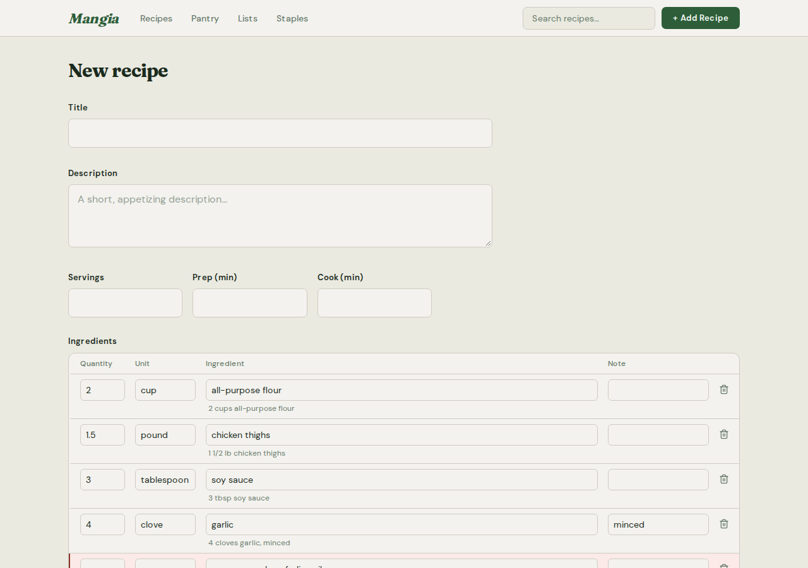
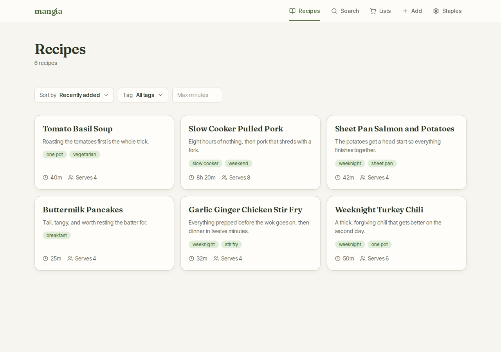
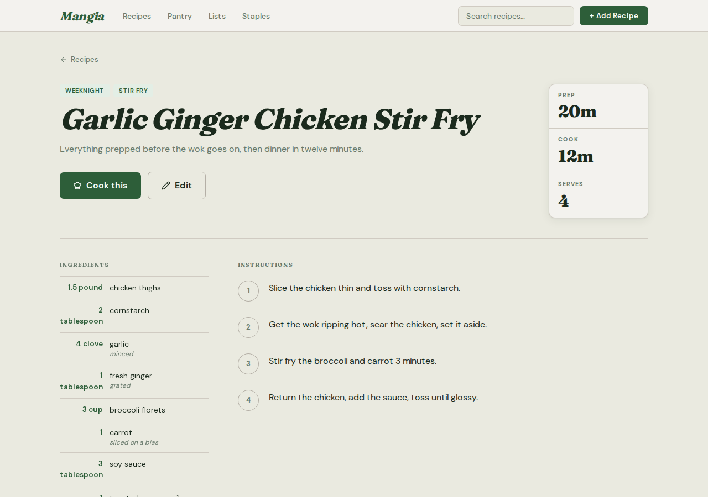
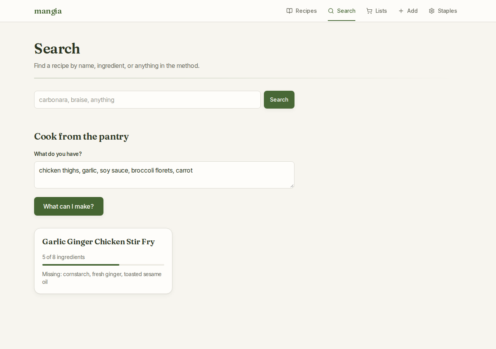
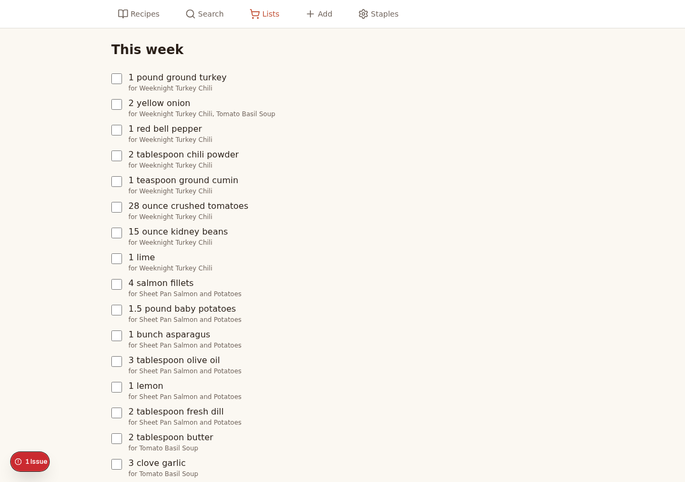

# mangia

A self-hosted recipe manager. Single user, no login, one SQLite file.

## Screenshots

The recipes below are mock data, seeded by the capture script.

**Entering a recipe** — paste the ingredient list in one blob and it comes back
as editable rows. Lines the parser is unsure of are flagged in amber and can be
handed to the LLM.



**Browsing** — sort by recency or total time, filter by tag or by how long you
have.



**A recipe** — ingredients, method, and tags.



**Cooking from what you have** — type in your ingredients and see what is
within reach, with the gaps called out.



**Shopping list** — pick some recipes and the ingredients merge across them,
with each line tracing back to the recipes that wanted it.



To regenerate these after a UI change:

```bash
npm run screenshots
```

That rebuilds `e2e.db`, seeds the mock recipes, and overwrites
`docs/screenshots/`. It needs the Playwright browser (see [Tests](#tests)).

## Run it

```bash
cp .env.example .env   # optional: everything here is also settable in the UI
docker compose up -d
```

Open <http://localhost:3000>.

All state lives in the `mangia-data` volume at `/data`. Back it up by
copying that directory while the container is stopped.

## Develop

Requires **Node 22 or newer** — `better-sqlite3` declares `engines: >=22` and
ships prebuilt binaries for the Node 22 ABI. On Node 20 the native module
segfaults rather than failing cleanly.

```bash
npm install                       # postinstall runs `prisma generate`
cp .env.example .env
sed -i 's|^DATABASE_URL=.*|DATABASE_URL="file:./dev.db"|' .env
npm run db:migrate                # creates dev.db and applies migrations
node scripts/ensure-fts.mjs       # builds the FTS5 table and its triggers
npm run dev
```

Open <http://localhost:3000>.

The FTS5 virtual table lives outside the Prisma schema, so
`scripts/ensure-fts.mjs` has to run after any reset of the database. It is
idempotent — running it again on an up-to-date database is a no-op.

Pulling new work onto an existing `dev.db` needs `npm run db:migrate` too. Both
test databases are built from scratch on every run, so no test covers the
upgrade path — a missing table shows up first as a runtime error in the browser.

### Tests

```bash
npm run typecheck   # tsc --noEmit
npm test            # unit and component tests (vitest)
npm run test:e2e    # rebuilds e2e.db, then runs Playwright
npm run test:all    # all three, in that order
```

On a fresh clone the browser has to be installed once before the e2e suite
will run:

```bash
npx playwright install --with-deps chromium
```

`npm run test:e2e` drops and recreates `e2e.db` before every run, so it never
touches `dev.db`. Running `npx playwright test` directly skips that setup and
will fail against a missing database.

### Other scripts

```bash
npm run build       # production build (output: standalone)
npm run db:generate # regenerate the Prisma client into src/generated/prisma
npm run db:studio   # browse the database
```

## Entering recipes

Three doors, all on **Add**:

1. **Paste a block of ingredients.** Parsed locally with no model call.
   Anything the parser is unsure of is flagged amber; one button sends only
   those lines to the LLM.
2. **Paste a URL.** JSON-LD is tried first; the model is a fallback.
3. **Type it out.** The same review table, starting empty.

Every row keeps its original text, so nothing is lost to a bad parse.

## Settings

Everything configurable lives at **/settings**, and nothing there needs a
restart to take effect. Secrets are shown masked — an API key as its last four
characters, a Google service account as its address — and a field you do not
open is left exactly as it was.

Each setting can also come from the environment. A value saved in the UI wins;
`.env` is the fallback, which is what makes a fresh container start configured.

| Setting | Environment fallback |
| --- | --- |
| Provider, API key, model, base URL | `LLM_PROVIDER`, `LLM_API_KEY`, `LLM_MODEL`, `LLM_BASE_URL` |
| Service account key, folder id, interval | `GOOGLE_DRIVE_CREDENTIALS`, `GOOGLE_DRIVE_FOLDER_ID`, `GOOGLE_DRIVE_BACKUP_INTERVAL_HOURS` |

### LLM providers

Choose Gemini with an API key, or an OpenAI-compatible endpoint pointed at
Ollama or LM Studio via its base URL. The app works without either — you lose
URL import and the AI clean-up button, nothing else.
