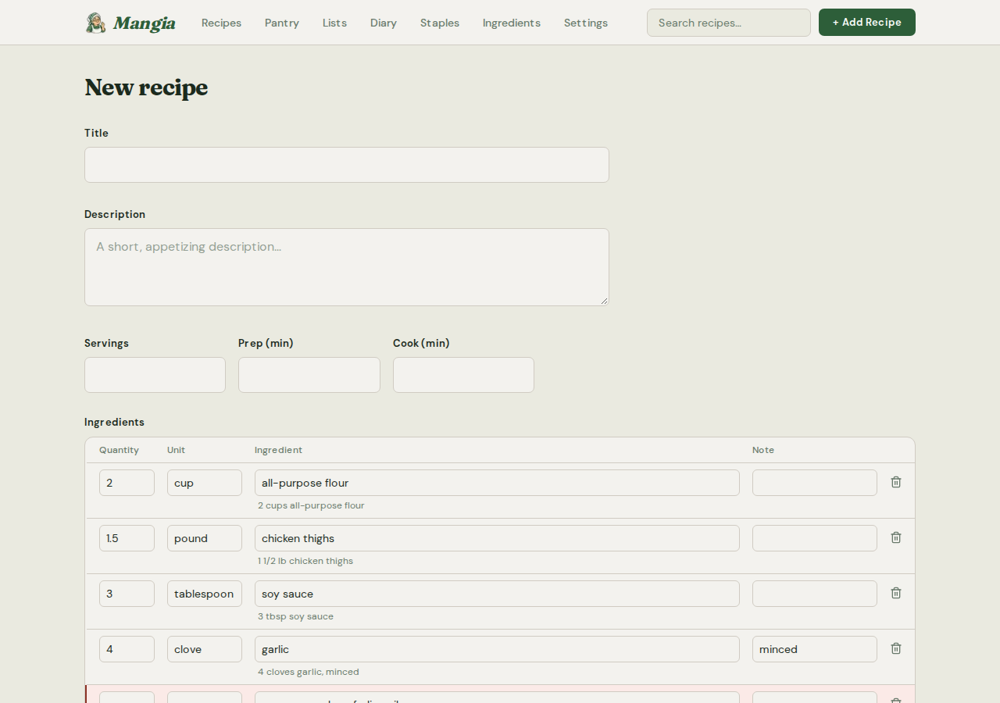
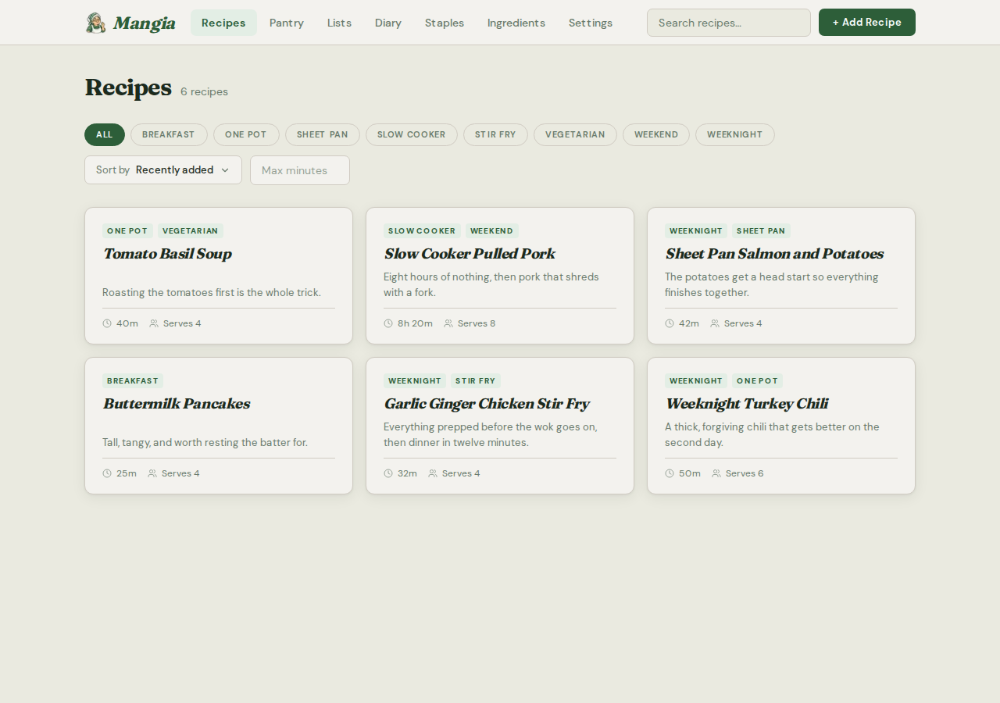
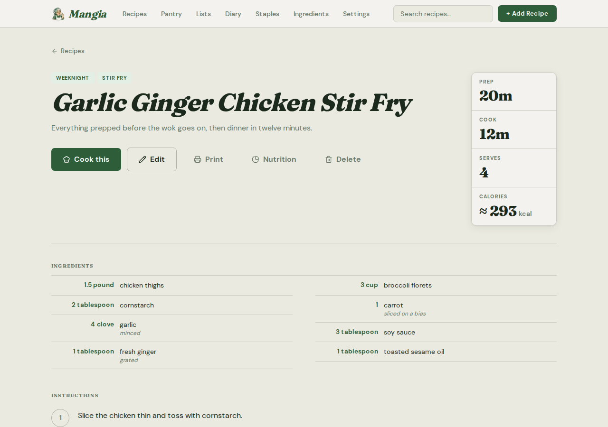
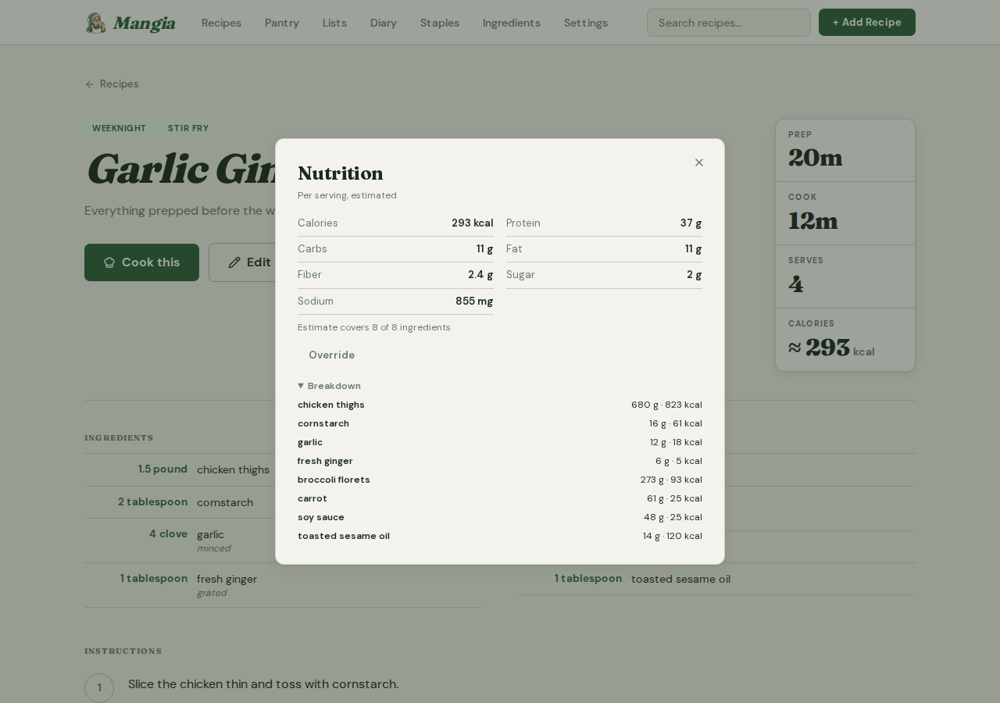
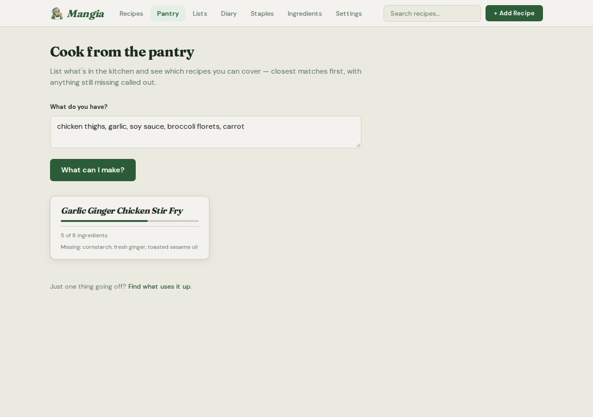
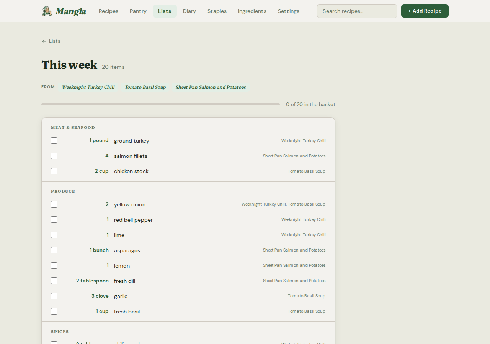

# mangia

A self-hosted recipe manager. Single user, no login, one SQLite file.

## Screenshots

The recipes below are mock data, seeded by the capture script.

**Entering a recipe** — paste the ingredient list in one blob and it comes back
as editable rows. Lines the parser is unsure of are flagged in amber and can be
handed to the LLM.



**Browsing** — sort by recency or total time, filter by tag or by how long you
have.



**A recipe** — the whole ingredient list gathered above the method, with the
times and an estimated calorie count beside the title.



**Nutrition** — per-serving macros estimated from USDA data, opened from the
recipe's action row, with a line-by-line breakdown of what was counted.



**Cooking from what you have** — type in your ingredients and see what is
within reach, with the gaps called out.



**Shopping list** — pick some recipes and the ingredients merge across them,
with each line tracing back to the recipes that wanted it.



To regenerate these after a UI change:

```bash
npm run screenshots
```

That rebuilds `e2e.db`, seeds the mock recipes and their ingredient
nutrition, and overwrites
`docs/screenshots/`. It needs the Playwright browser (see [Tests](#tests)).

## Run it

```bash
cp .env.example .env   # optional: everything here is also settable in the UI
docker compose up -d
```

Open <http://localhost:3000>.

All state lives in the `mangia-data` volume at `/data`. Back it up by
copying that directory while the container is stopped.

A prebuilt image is also published to GHCR on every push to `master`, so you
don't have to build locally: `ghcr.io/vinnymicale/mangia:latest`.

### Unraid

Use the bundled template so every field — image, WebUI link, port, and all
variables — is pre-filled. The **Add Container** page's "Template" dropdown
only lists templates Unraid already has on disk, so first drop the template
file where it looks for them. On the Unraid box (**Tools → Web Terminal**):

```bash
wget -O /boot/config/plugins/dockerMan/templates-user/my-mangia.xml \
  https://raw.githubusercontent.com/vinnymicale/mangia/master/unraid-template.xml
```

Then **Docker → Add Container**, open the **Template** dropdown, and pick
**my-mangia** (under "User templates"). Every field populates, including
every environment variable the app supports — nothing is required, so you can
click **Apply** immediately for an unconfigured instance, or fill in an LLM
key first. Point the **Data** path at a real share (it defaults to
`/mnt/user/appdata/mangia`) so the database survives container rebuilds. All
of this is editable later from the container's **Edit** screen, and every
value is also settable from **/settings** in the running app without a
restart.

#### Environment variables

| Variable | Required | Default | Notes |
| --- | --- | --- | --- |
| `LLM_PROVIDER` | no | `gemini` | `gemini` or `openai-compatible` (Ollama, LM Studio, vLLM…). Only needed for URL and video import, the AI clean-up button, higher-quality photo reading, and help matching foods for nutrition. Video import needs `gemini`. |
| `LLM_API_KEY` | no | — | API key for the chosen provider. Leave blank for an `openai-compatible` endpoint that doesn't require one. |
| `LLM_MODEL` | no | `gemini-2.5-flash` | Defaults to `gemini-2.5-flash` for gemini, `gpt-4o-mini` for openai-compatible. |
| `LLM_BASE_URL` | no | — | Only for `openai-compatible`, e.g. `http://192.168.1.10:11434/v1` for Ollama. |
| `GOOGLE_DRIVE_CREDENTIALS` | no | — | Service account key JSON, or a path to it, for Google Drive backups. Easier to set from **/settings**, which lets you pick the file instead of pasting JSON. |
| `GOOGLE_DRIVE_FOLDER_ID` | no | — | The Drive folder to upload backups into. Share it with the service account's address. |
| `GOOGLE_DRIVE_BACKUP_INTERVAL_HOURS` | no | `24` | Hours between Google Drive backups. |
| `USDA_API_KEY` | no | `DEMO_KEY` | FoodData Central key for nutrition estimates, free from [api.data.gov](https://api.data.gov/signup/). Without one the shared `DEMO_KEY` is used, limited to 30 lookups an hour. |

## Develop

Requires **Node 22 or newer** — `better-sqlite3` declares `engines: >=22` and
ships prebuilt binaries for the Node 22 ABI. On Node 20 the native module
segfaults rather than failing cleanly.

```bash
npm install                       # postinstall runs `prisma generate`
cp .env.example .env
sed -i 's|^DATABASE_URL=.*|DATABASE_URL="file:./dev.db"|' .env
npm run db:migrate                # creates dev.db and applies migrations
node scripts/ensure-fts.mjs       # builds the FTS5 table and its triggers
npm run dev
```

Open <http://localhost:3000>.

The FTS5 virtual table lives outside the Prisma schema, so
`scripts/ensure-fts.mjs` has to run after any reset of the database. It is
idempotent — running it again on an up-to-date database is a no-op.

Pulling new work onto an existing `dev.db` needs `npm run db:migrate` too. Both
test databases are built from scratch on every run, so no test covers the
upgrade path — a missing table shows up first as a runtime error in the browser.

### Tests

```bash
npm run typecheck   # tsc --noEmit
npm test            # unit and component tests (vitest)
npm run test:e2e    # rebuilds e2e.db, then runs Playwright
npm run test:all    # all three, in that order
```

On a fresh clone the browser has to be installed once before the e2e suite
will run:

```bash
npx playwright install --with-deps chromium
```

`npm run test:e2e` drops and recreates `e2e.db` before every run, so it never
touches `dev.db`. Running `npx playwright test` directly skips that setup and
will fail against a missing database.

### Other scripts

```bash
npm run build       # production build (output: standalone)
npm run db:generate # regenerate the Prisma client into src/generated/prisma
npm run db:studio   # browse the database
```

## Entering recipes

Four doors, all on **Add**:

1. **Paste a block of ingredients.** Parsed locally with no model call.
   Anything the parser is unsure of is flagged amber; one button sends only
   those lines to the LLM.
2. **Paste a URL.** JSON-LD is tried first; the model is a fallback. YouTube,
   Instagram and TikTok links are read as videos instead — see below.
3. **Photograph a card.** See below.
4. **Type it out.** The same review table, starting empty.

Every row keeps its original text, so nothing is lost to a bad parse.

### From a photo

Upload or shoot a photo of a recipe — a card, a page, a sheet of someone's
handwriting — and it is read into the same review form the other doors lead
to, filled in and waiting to be corrected. The photo stays above the form,
collapsible, so the reading can be checked against the card without leaving
the page. Nothing is saved until you press save.

A configured model reads it if there is one, because a model handles
handwriting and layout far better. Without one — or if the call fails — it
falls back to on-device text recognition (tesseract.js), which runs entirely
in the container and sends nothing anywhere. That path is rougher, especially
on handwriting, and it tells you so; printed cards come through well. Either
way it attempts a full split into title, times, ingredients, and method
rather than dumping raw text.

The photo itself is discarded once the recipe is saved, unless you tick
**Keep the original photo with the recipe**, which is off by default. Kept
photos are scaled down a little, stored beside the recipe in the database,
shown on the recipe page, and included in exports and backups.

The first photo read in a fresh container downloads its language data
(~5 MB), so it is slower than the ones after it.

### From a video

A YouTube, Instagram or TikTok link goes down a short ladder. The caption is
tried first: if it is long enough and names amounts, it is parsed like any
pasted recipe and the video is never touched. Otherwise the video itself goes
to the model — YouTube by URL, Instagram and TikTok downloaded with `yt-dlp`
and sent as bytes. The form says which rung produced the draft.

Reading the video needs Gemini; the `openai-compatible` provider only gets the
caption rung. The Docker image ships `yt-dlp` but not `ffmpeg`, so the download
asks for a single progressive MP4. Any other link is treated as an article.

## Nutrition

Every recipe gets an estimate of calories, protein, carbs, fat, fiber, sugar
and sodium, per serving when the servings are known and for the whole recipe
otherwise. The calories show beside the title; the rest is behind the
**Nutrition** button in the recipe's action row, along with a breakdown of what
each ingredient contributed.

The figures come from [USDA FoodData Central](https://fdc.nal.usda.gov/)
(Foundation and SR Legacy foods). Values per 100 g and the weight of units like
"1 cup" or "2 cloves" are stored per ingredient, not per recipe, so one lookup
serves every recipe that uses it. Lookups start on their own the first time a
recipe is opened, and never hold up the page.

When a food can't be matched or a unit has no known weight, the dialog lists it
as needing input: enter the values by hand, retry the lookup, or leave it out.
With an LLM configured it can pick the right FoodData Central match, estimate a
unit's weight, and suggest values for things USDA doesn't carry. Without one,
only a confident top search result is trusted and the rest is left to you.

- **Override** a recipe's figures outright — from the back of a book, say —
  with a note on where they came from.
- **/ingredients** lists every ingredient's stored values and unit weights, and
  an edit there reaches every recipe using it.
- The **print** card carries a one-line macro summary.
- Exports and backups carry the nutrition, and importing one fills gaps without
  overwriting values you already have.

A FoodData Central key is optional. Without one the shared `DEMO_KEY` is used,
which allows 30 lookups an hour — enough to get going, and lookups run one at a
time to stay under it. A free key from [api.data.gov](https://api.data.gov/signup/)
lifts the limit.

## Around the app

- **Recipes** — the library: sort by recency or total time, filter by tag or
  by how many minutes you have. **Search** covers titles, descriptions,
  ingredients, method and notes.
- **A recipe** — a cook view that splits the method into checkable steps, a
  print card, editing, a log of when it was cooked with notes, and the
  original photo if one was kept.
- **Pantry** — "what can I make?" Enter what you have; recipes are ranked on
  how little is missing.
- **Leftovers** — the other way round: "what uses this?" Name the half tub of
  ricotta and see recipes ranked on how little else they need.
- **Lists** — shopping lists merged across recipes, each line tracing back to
  the recipes that wanted it. Staples you always have are skipped by
  default.
- **Diary** — every cook across all recipes: what was made lately, what gets
  made most, and what has been quietly forgotten.
- **Staples** — what you always have on hand, plus a tag editor for renaming
  and merging tags.
- **Ingredients** — the nutrition values described above.
- **Settings** — the LLM, the FoodData Central key, and backups.

### Backups

**/settings** can download every recipe as one
`mangia-backup-YYYY-MM-DD.json` file and import one back; imported recipes are
added alongside what is already there. It can also upload a backup to Google
Drive on an interval, using a service account and a folder shared with it.

## Settings

Everything configurable lives at **/settings**, and nothing there needs a
restart to take effect. Secrets are shown masked — an API key as its last four
characters, a Google service account as its address — and a field you do not
open is left exactly as it was.

Each setting can also come from the environment. A value saved in the UI wins;
`.env` is the fallback, which is what makes a fresh container start configured.

| Setting | Environment fallback |
| --- | --- |
| Provider, API key, model, base URL | `LLM_PROVIDER`, `LLM_API_KEY`, `LLM_MODEL`, `LLM_BASE_URL` |
| Service account key, folder id, interval | `GOOGLE_DRIVE_CREDENTIALS`, `GOOGLE_DRIVE_FOLDER_ID`, `GOOGLE_DRIVE_BACKUP_INTERVAL_HOURS` |
| USDA API key | `USDA_API_KEY` |

### LLM providers

Choose Gemini with an API key, or an OpenAI-compatible endpoint pointed at
Ollama or LM Studio via its base URL. The app works without either — you lose
URL import, video import and the AI clean-up button, photo import falls back
to on-device text recognition, and nutrition lookups trust only confident
matches, leaving the rest for you to fill in. Nothing else. Reading a video
needs Gemini; an OpenAI-compatible endpoint can't.
